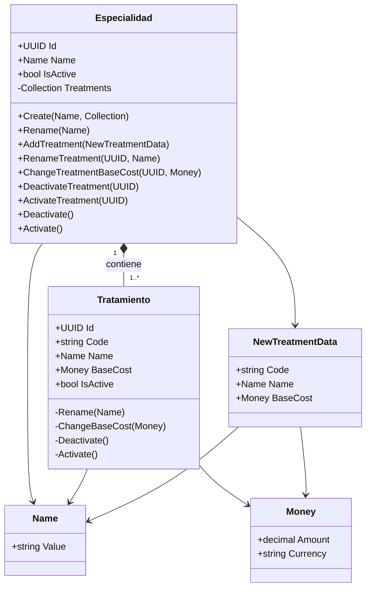

# UML Class Diagram – Module 01: Specialties

## Scope
Este diagrama representa el Modelo de Dominio para el módulo de Especialidades. Refleja el diseño de agregados y las invariantes de dominio definidas previamente.

## UML Diagram mermaid
