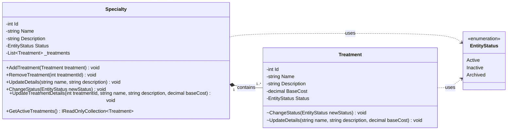

# UML Class Diagram – Module 01: Specialties

## Scope
This diagram represents the **Domain Model** for the Specialties module.
It reflects the aggregate design and domain invariants previously defined.

Application services, persistence, and infrastructure concerns are intentionally excluded.

---

## Domain Entities

### Specialty (Aggregate Root)
- Represents a medical specialty offered by the clinic.
- Owns and protects the lifecycle of its treatments.

### Treatment
- Represents a medical treatment belonging to a specialty.
- Cannot exist independently.

---

## Relationships

- A Specialty **composes** one or more Treatments.
- Composition implies lifecycle dependency.
- A Treatment belongs to exactly one Specialty.

Multiplicity:
- Specialty 1 —— 1..* Treatment

---

## Invariants (Visualized)
- A Specialty must always contain at least one Treatment.
- Treatments cannot be reassigned to another Specialty.
- State transitions are coordinated by the Specialty aggregate root.

---

## Diagram
